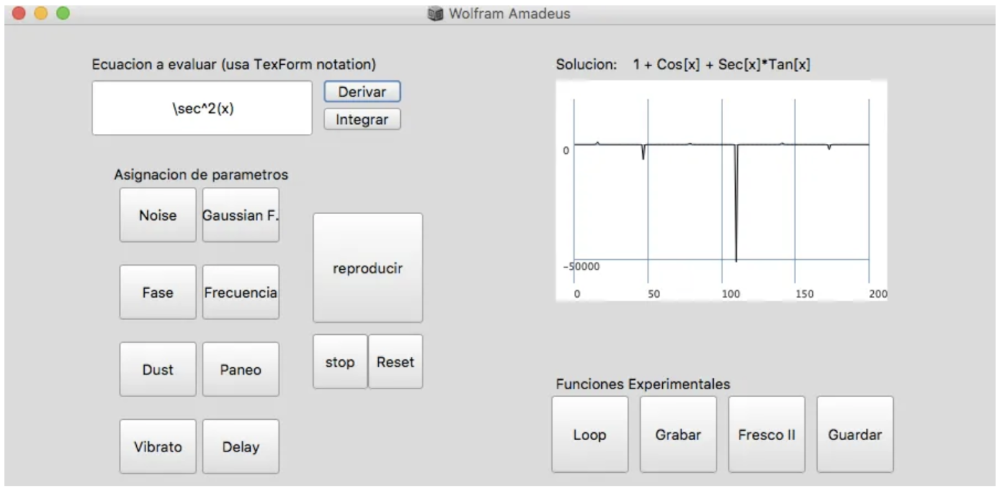

# WolframAmadeus

## Arquitectura del proyecto 

## Video tutorial del software - 
https://www.youtube.com/watch?v=D2h2Vl4OYZs

Licencia - GNU General Public License v3.0

## Protocolo de comunicación entre Mathematica y SC

#### Sistema de servidor-cliente donde el servidor es mathematica y SC es el cliente. 
El servidor escribe la información en un archivo de texto y el cliente lee la información del archivo.

No estoy utilizando un protocolo de comunicación tradicional. Es bastante rudimentario de hecho. Es necesario correr el código el código en SC y mathematica en paralelo. Tienes que tener Mathematica 9 instalado para correr el código (El código corre pero no se comporta de forma esperada en las nuevas versiones del Mathematica, especulo que las nuevas versiones descontinuaron algunas de las funciones que estoy usando ).

## Como Funciona
1. Una vez corriendo en paralelo ambos códigos ([ver tutorial](https://www.youtube.com/watch?v=D2h2Vl4OYZs)):
- WolframAmadeus/WolframAmadeus_01102016.scd 
- WolframAmadeus/wftemp/Integ-deriv_Program (con tabulacion).nb

2. El protocolo de comunicación consiste de un (pseudo)-sistema Servidor-Cliente donde Mathematica revisa cada X milisegundos si alguno de los archivos temporales en wftemp correspondientes a los diferentes procesos de cálculo ha sido modificado. 

4. En caso de que SC modifique el archivo .txt con una nueva función matemática, Mathematica tiene algunos .6 segs (Muchísimo tiempo) para leer el archivo de texto y comenzar a procesar la función. Después de este tiempo, el archivo es reseteado a un valor default (cero).

5. Entonces, Mathematica procesará esta función de Cálculo Integral/Diferencial, la cual debió ser escrita en SC por el usuario en textFormat (nada agradable de escribir, lo sé, te invito a mejorarlo ;) ). 

- Tomemos en cuenta que la función puede ser súper compleja, Wolfram Mathematica es capaz de resolver las más dificiles de las integrales, todo ingeniero ha usado el servicio web (mucho más lento que el embebido en su IDE) en cuestión de segundos. 

6. Una vez resuelta la función se reenvía a SC con el mismo protocolo de comunicación.

7. Entonces SC utiliza el arreglo de valores de la gráfica de la respuesta general de la función para ser stremeada por cada uno de los módulos que se mencionan más adelante.

### Componentes

#### 1 Servidor de procesamientos matemáticos

Funcion integradora y Funcion derivadora
Realiza con Wolfram Mathematica (Versión 9) todas las operaciones de cáculo  enviadas por SuperCollider y regresa una solución general al problema así como los puntos de la gráfica de la función matemática, tal gráfica será usada por SuperCollider para llenar un arreglo unidimensional de valores que serán servidos en un streams paralelos a diferentes generadores de audio para construir la experiencia sonora.

#### 2.GUI y asignación de paramétros

En esta seccion, a partir de synths y generadores unitarios se crearán patrones, escalas y efectos.

#### 3.GUI - Interfaz para el usuario.

## Módulos
El proyecto está dividido por modulos de funciones para que estos puedan ser programados simultaneamente.

- Modulo de integracion 
Funcion de integracion que devuelva la solución y la gráfica

- Modulo de derivacion 
Funcion de derivacion que devuelva la solución y la gráfica

- Modulo de patrones 
Funcion que generará un patrón de percusiones en caso de que a gráfica de la solucion controle el volumen de la señal raiz

- Modulo de reverb 
Funcion que generará un reverb en caso que la grafica de la solucion controle un reverb sobre la señal raiz

- Modulo de desfase 
Funcion que genere un desfase en caso de que la grafica de la solucion controle la fase de una señal raiz

- Modulo Pulso  
Funcion que genere un pulso cuando queremos que la gráfica controle la tasa de pulsos

- Modulo de paneo  
funcion que panie el synth raiz

- Modulo de vibrato 
vibrato sobre el synth raiz

- Modulo de delay 
delay sobre la senal raiz

Por Diego Ignacio Ortega
